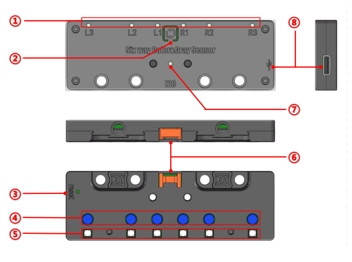

## Structure



| **No.** | **Name**      | **Description**                                              |
| :-----: | ------------- | ------------------------------------------------------------ |
|    ①    | Indicator LED | Lights up when the corresponding probe detects a "black line" |
|    ②    | Learn Button  | Click to enter learning mode; long press to switch device address |
|    ③    | Reset Button  | Used to reset the sensor                                     |
|    ④    | Light Sensor  | Six probes of the six-channel color grayscale sensor         |
|    ⑤    | Fill Light    | Supplemental lights corresponding to each probe              |
|    ⑥    | Interface     | HY2.0-4P port for power supply and signal transmission       |
|    ⑦    | Address LED   | Indicates the address via different colors                   |
|    ⑧    | Type-C Port   | Used for power supply and firmware updates                   |

## Address Selection

The six way color & gray sensor has 1 universal I²C slave address and 4 switchable addresses, each identified by a different LED color. When only one sensor is used in a scenario, the device address can be ignored, and the universal address can be used directly. If multiple sensors are used, each must be assigned a unique address for differentiation, and the corresponding address must be selected during programming.

**I²C Address Switching Method:** Long press the learn button until the address LED changes color,then release.

The table below lists the I²C slave addresses and corresponding LED colors:

| **I²C Slave Address** | **Sensor LED Color** |
| --------------------- | -------------------- |
| 0x70 (Universal)      | Any                  |
| 0x71                  | White                |
| 0x72                  | Cyan                 |
| 0x73                  | Magenta              |
| 0x74                  | Blue                 |

## Communication Protocol

***Write*** 
Send the following control bytes to the device to enter corresponding modes:

| ***\*Control Byte\**** | ***\*Mode\****                |
| ---------------------- | ----------------------------- |
| 0x00                   | No State                      |
| 0x01                   | Color Recognition             |
| 0x02                   | Grayscale Recognition         |
| 0x03                   | Binarization Recognition      |
| 0x04                   | Grayscale Learning            |
| 0x05                   | Binarization Learning         |
| 0x06                   | Red Learning                  |
| 0x07                   | Yellow Learning               |
| 0x08                   | Green Learning                |
| 0x09                   | Cyan Learning                 |
| 0x0A                   | Blue Learning                 |
| 0x0B                   | Purple Learning               |
| 0x0C                   | Clear All Color Learning Data |

***Read***

Read six consecutive bytes from the target I²C address. Each byte represents the recognition result of a channel (left to right).

### Example Code (Arduino)

#### Color Recognition

```c++
#include <Arduino.h> 
#include <Wire.h> 

void setup() 
{ 
	Wire.beginTransmission(0x70); // Device address 	
    Wire.write(0x01); // Color recognition mode 	
    Wire.endTransmission(); 
}
void loop() 
{ 
	uint8_trev_data[6] = {0}; 
	uint8_trev_count=0; 
	Wire.requestFrom(0x70, 6); // Read six bytes 
	while (Wire.available()) 
	 {  
		rev_data[rev_count++] =Wire.read(); 
	 }  
	printf("%d %d %d %d %d %d", rev_data[0], rev_data[1], rev_data[2], rev_data[3], rev_data[4], rev_data[5]); 
	delay(50); 
}
```

> Supported colors: red, yellow, green, cyan, blue, and purple. 0: No detection; 1-6 represent the above colors.

#### Grayscale Recognition

```c++
#include <Arduino.h> 
#include <Wire.h> 
void setup() 
{ 
	Wire.beginTransmission(0x70); // Device address 	
    Wire.write(0x02); // Grayscale recognition mode 	
    Wire.endTransmission(); 
} 

void loop() 
{ 
	uint8_trev_data[6] = {0}; 
	uint8_trev_count=0; 
	Wire.requestFrom(0x70, 6); // Read six bytes 	
    while (Wire.available()) 
    {  
		rev_data[rev_count++] =Wire.read();  
    }  
	printf("%d %d %d %d %d %d", rev_data[0], rev_data[1], rev_data[2], rev_data[3], rev_data[4], rev_data[5]); 
	delay(50); 
}
```

> Outputs analog values (0-255) for each channel.

#### Binarization Recognition

```c++
#include <Arduino.h> 
#include <Wire.h> 
void setup() 
{ 
	Wire.beginTransmission(0x70); // Device address  	 
    Wire.write(0x03); // Binarization mode  
	Wire.endTransmission();  
} 
void loop() 
{ 
	 uint8_t rev_data[6] = {0};  
	 uint8_t rev_count = 0;  
	 Wire.requestFrom(0x70, 6); // Read six bytes  
	 while (Wire.available())  
	 {  
		 rev_data[rev_count++] = Wire.read();  
	 }  
	 printf("%d %d %d %d %d %d", rev_data[0], rev_data[1], rev_data[2], rev_data[3], rev_data[4], rev_data[5]); 
	 delay(50);  
} 
```

> Outputs digital signals (0 or 1). 1: Black line detected; 0: No detection.

#### Clear Color Learning Data

```c++
#include <Arduino.h> 
#include <Wire.h> 
void setup() 
{ 
	Wire.beginTransmission(0x70); // Device address 	
    Wire.write(0x0C); // Clear all color learned data 	
    Wire.endTransmission(); 
} 
voidloop() 
{ 
} 

```

## Learning

To enhance user convenience, the sensor is equipped with a built-in self-learning function. Users can activate this function either through a button or program control, enabling the sensor to automatically adapt to ambient lighting conditions. This provides a fast and user-friendly experience.

### Button-Controlled Grayscale Learning

1. First, place the four probes of the sensor flat on the background of the line-following map, ensuring the sensor is at a height of 5mm to 15mm from the surface.
2. Next, press the learning button to activate the learning mode.
3. When you observe the 6 line-following status LEDs blinking rapidly, it indicates that the sensor has entered the learning preparation state.
4. At this point, while maintaining the sensor at a consistent height above the map background and the line, gently tilt or move the sensor so that each probe can detect both the background and the line. This action helps the sensor capture and learn the characteristic differences between the background and the line.
5. Continue tilting or moving the sensor until the LEDs stop blinking rapidly (this process typically takes about 5 seconds). This indicates that the sensor has completed the learning process and successfully captured the required parameters.
6. Once the learning is complete, the relevant parameters will be automatically stored inside the sensor for future use. These learned values are retained even after power-off and will remain effective until they are replaced by a new learning session.

### Program-Controlled Grayscale Learning

When the installation position of the six way color & gray sensor makes it inconvenient to directly operate the learning button, you can control the sensor's operation through calibration program commands. By specifying the **address**, you can instruct the sensor with the corresponding address to enter the learning mode. For detailed steps on the learning operation, please refer to the **Button-Based Learning** section described earlier.

## Program-Controlled Color Learning

1. Put each path on the color you want to identify (unless you only care about the color recognition of a few of them, you can just put a few of them on the color).
2. Start color learning through the program.
3. Wait for the flashing of the light to end, indicating that the color recognition learning is complete.
4. After the learning is completed, the relevant parameters will be automatically stored in the sensor for subsequent use, and the learning value will be saved after power-off until the corresponding color is replaced after the next learning.

### Grayscale Learning

```c++
#include <Arduino.h>
#include <Wire.h>
void setup()
{
    Wire.beginTransmission(0x70); // Device address
    Wire.write(0x04); // Grayscale learning
    Wire.endTransmission();
}
void loop()
{
}
```

### Binarization Learning

```c++
#include <Arduino.h>
#include <Wire.h>
void setup()
{
    Wire.beginTransmission(0x70); // Device address
    Wire.write(0x05); // Binarization learning
    Wire.endTransmission();
}
void loop()
{
}
```

### Color Learning

```c++
#include <Arduino.h>
#include <Wire.h>
void setup()
{
    Wire.beginTransmission(0x70); // Device address
    Wire.write(0x06); // Red learning
    Wire.endTransmission();
}
void loop()
{
}
```

## Firmware Update

1. Connect the USB port on the right side to the computer, which will be recognized as a CH340 serial port. Set the following parameters:

- **Baud Rate**: 115200
- **Data Bits**: 8
- **Parity**: None
- **Stop Bits**: 1
- **Flow Control**: None

2. Press and hold the **Learning Button** while pressing the **Reset Button** to enter IAP (In Application Programming) mode.
3. After entering IAP mode, the serial port will receive menu option information. Follow the prompts to send the corresponding options.
4. When entering the receiving state, the serial port will continuously receive the character 'C'.
5. IAP uses the **Ymodem protocol**. Use a file transfer tool that supports this protocol to upload the firmware update file.
6. After the transfer is complete, the serial port will receive the menu options again. Follow the prompts to select the appropriate option to enter the main program (or simply power off and reset the device)
